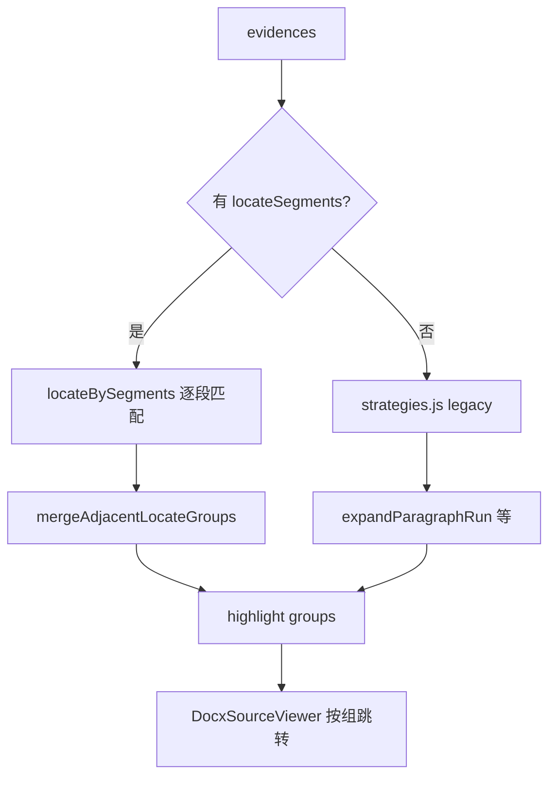

# 证据高亮（docx-preview DOM 文本匹配）

## 适用场景

后端返回 `evidences[]`（`text`、`blockType`、`sourceBlockIds`、可选 **`locateSegments[]`**），在已渲染 docx HTML 上定位高亮，支持多处跳转。  
前置：[`docx-preview.md`](./docx-preview.md)（**无 `data-block-id`**）。  
后端 segment 契约：[`../backend/evidence-locate-segments.md`](../backend/evidence-locate-segments.md)。  
Context Parent 含整表：[`../document/chunking-parent-child.md`](../document/chunking-parent-child.md)。

## 总流程

| 条件 | 入口 | 行为 |
|------|------|------|
| `locateSegments.length > 0` | `locateBySegments.js` | 逐 segment excerpt 匹配；**禁用** legacy `expandParagraphRun` |
| 无 segments（旧任务） | `strategies.js` | 按 `blockType` 分派 + parent 多段 run 扩展 |

## 模块职责

| 模块 | 职责 |
|------|------|
| `normalize.js` | 文本归一化、去 path 前缀、`extractTableCaption`、`buildTableRowCandidates` |
| `dom.js` | `findSmallestMatch`、`findTableAfterCaption`、`resolveTableRows`、`expandParagraphRun`、`used` 互斥 |
| `strategies.js` | legacy 段落/表/表行分派 |
| `locateBySegments.js` | segment 级段落/表定位 |
| `segmentGroups.js` | Context 组合并（展示 + 定位组数） |
| `index.js` | `highlightEvidences` 总入口 |

## Segment 类型 → DOM

| blockType / locateKind | 行为 |
|------------------------|------|
| paragraph / body | 容器内最短 `
` 匹配 excerpt；**排除** table 内 `
`、目录行 |
| table / table_body | 表题锚定或表体行匹配 → **整表** `<table>` 高亮 |
| table_row | `<tr>` / `<td>` |
| caption / table_caption（旧） | **跳过**，不参与定位与左栏展示 |

### 段落 segment（`findParagraphSegment`）

- `normalizeText(excerpt)` 长度 ≥ 4
- 遍历容器内 `
`：`findSmallestMatch` 等价逻辑（最短包含 excerpt 的节点）
- 跳过：`isBlocked(used)`、`<table>` 内段落、`isTocLine`（`/^\d+(\.\d+)*\s+.+\s+\d{1,4}$/` 且无句号）

### 表格 segment（`locateTableElements`）

**顺序**：表题锚定 → 表体内容回退。

1. **`locateTableByCaption`**：`extractTableCaption` 从 path/body 取 `表N-M` → `findTableAfterCaption`
   - 找含表题文字的 `
`，取**紧邻兄弟** `<table>`（或 wrapper 内 nested table）
   - **表题段已被段落 segment 占用时仍可作为锚点**（不对 caption `
` 做 `used` 跳过）
   - `resolveTableRows`：`rowFrom/rowTo` 为 0 → 返回整表 `[table]`

2. **`locateTableByContent`**：`buildTableRowCandidates`（过滤纯表头「序号+名称」）→ 行匹配
   - 命中 `<tr>` 且 `rowFrom/rowTo` 为 0 → **`closest('table')` 整表**，不单行
   - segment 落库后：`locateSegmentElements` 再保证返回 `<table>` 元素

3. **禁止**单独 synthetic caption segment + 全局 `findTableAfterCaption` 误亮无关表（caption 仅作 segment 边界，不单独定位）。

### Legacy 段落（无 segments）

1. `sourceBlockIds.length > 1`：首段锚点 + **`expandParagraphRun`** 向下取连续 `
`
2. 多角色行（`试验工程师：`…）：`matchParagraphLines` 逐行
3. 否则：`buildParagraphCandidates` + `findSmallestMatch`
4. **`used` Set**：同规则多条证据 DOM 互斥（含父子节点）

## Context Unit 合并（段落 + 表 + 段落）

与后端 Context Parent（`sourceBlockIds` 含 `TBL-*`）对齐。

### 左栏展示（`segmentGroups.js`）

| 函数 | 规则 |
|------|------|
| `groupAdjacentContextSegments` | 连续非 caption segment 合并为一组（段+表+段） |
| `evidenceIncludesTableSource` | `sourceBlockIds` 含 `TBL-*` |
| `countEvidenceDisplayGroups` | 含 TBL → **恒为 1** 组；否则 context 分组数 |
| 左栏含表 | **完整 `evidence.text`** 一块展示；segments 仅用于跳转 |
| 含表组 | `displayTextForGroup` 优先 `fullText`，不用 excerpt 拼接 |
| `textForParagraphGroup` | 纯段落组：用 `evidence.text` 按 excerpt 锚点还原；**不在 `^表\d` 处截断** |

caption segment（旧 `locateKind=caption`）仅作**分界**，不参与展示/定位。

### 源文档定位合并（`mergeAdjacentLocateGroups`）

| 条件 | 行为 |
|------|------|
| `sourceBlockIds` 含 `TBL-*`，或 segments 含 `table_body` | **该 evidence 全部命中 DOM 合并为 1 组**（中间 segment 定位失败也不拆导航） |
| 否则 | 按 `areSegmentsContextAdjacent` 合并相邻 segment（中间仅允许 caption 间隔） |

`countEvidenceDisplayGroups` 与 DocxSourceViewer `totalSegments` / `onLocateSummary` 一致。

## 分页与归一化

- **pageFrom**：`resolveSearchContainer` → `pageContainers[pageFrom - 1]`；segment 级优先于 evidence 级
- **normalizeText**：`－→-`、`：→:`，再去空白
- **TOC 排除**：见上 regex

## 高亮样式

- 类名：`docx-source-highlight` / `docx-source-highlight-active`
- 背景：`#fef3c7`（段落与表统一）
- 嵌套高亮：内层 `background: transparent`，避免叠色
- 整表高亮：`<table>` 或 `tr.docx-source-highlight`
- **`position: relative` 可保留**（与 docx-num 修正后并存）

## 位置元信息

- path 已含 `表6-2` 时**不**再显示 `表格 T9`（`shouldShowTableNo`）
- 有 segments 时**不**重复证据级 + segment 级位置行；置信度挂在第一组 meta

## 源文档弹窗

- `highlightEvidences` → `{ elements, evidence, segment, segmentIndex, segments? }[]`
- 工具栏：`段 N/M · 第 X 页 · blockId`（**合并后组数**）
- `initialSegmentIndex`：左栏 segment 点击 → 弹窗定位
- `onLocateSummary`：`已定位 matched/total 段`

## PDF

- 有 segments：`groupAdjacentContextSegments` + 含表时用完整 `evidence.text`
- `countEvidenceDisplayGroups` 计段；`bbox` 优先，excerpt 文本回退
- 坐标：见 [`pdfjs-highlight.md`](./pdfjs-highlight.md)

## 踩坑

| 现象 | 根因 | 处理 |
|------|------|------|
| 段+表 evidence 显示 4 处导航 | 每 segment 单独成组；中间定位失败 | Context Unit 强制 `mergeAdjacentLocateGroups` 合并为 1 组 |
| 表只高亮第一行 | `locateTableByContent` 只返回 `<tr>` | `rowFrom=0` 时 `closest('table')` 整表 |
| 表 7-1 整表未亮 | 表题段已 `used`，caption 路径失败 | `findTableAfterCaption` 不因 caption 段 `used` 跳过 |
| 左栏表体缺失 | excerpt 拼接 / `^表\d` 截断 | 含 TBL 用完整 `evidence.text` |
| 0 命中 | render 未完成 / 旧任务无 segments | 等 render；重跑审核拿 segments |
| 目录误匹配 | 全局 `
` 搜索 | pageFrom + TOC 过滤 |
| docx-num 双序号 | 见 docx-preview.md | 隐藏 `::before` 或 span，勿全局误伤 |

## 反模式

- 假设 docx-preview 节点带 blockId
- 全文最长子串搜索
- 有 segments 仍对 parent 用 `expandParagraphRun`
- 表 segment 只高亮单行 `<tr>`
- caption 段 `used` 后放弃表题锚定
- 纯段落组合并用 `^表\d` 截断 `evidence.text`
- 证据级 + segment 级双行位置 meta

## 项目来源

Context Unit + locateSegments 段落表连续定位，2026-06 验证（表 7-1 / 表 7-2 / 试验报告清单等）。
