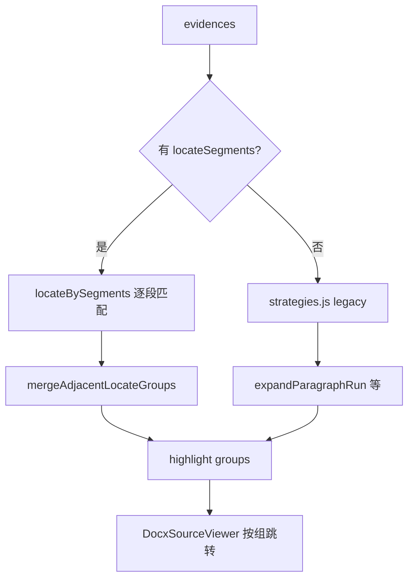

# 证据高亮（docx-preview DOM 文本匹配）

## 适用场景

后端返回 `evidences[]`（含 `text`、`blockType`、可选 **`locateSegments[]`**），在已渲染 docx HTML 上定位高亮，支持多处跳转。  
前置阅读：[`docx-preview.md`](./docx-preview.md)（**无 `data-block-id`**）。

后端定位层契约：[`../backend/evidence-locate-segments.md`](../backend/evidence-locate-segments.md)。

## 总流程

## 策略分派

| 条件 | 模块 | 行为 |
|------|------|------|
| `locateSegments.length > 0` | `locateBySegments.js` | 逐段 excerpt 匹配；**禁用** `expandParagraphRun` |
| 无 segments（旧任务） | `strategies.js` | 按 `blockType` 分派 + parent 多段 run 扩展 |

### Segment 类型 → DOM

| blockType / locateKind | 行为 |
|------------------------|------|
| paragraph / body | 容器内 `findSmallestMatch(excerpt)`；排除 table 内 `
`、目录行 |
| table / table_body | 表体文本 / 表题策略（`locateTableElements`） |
| table_row | `<tr>` / `<td>` |
| caption（旧数据） | **跳过**，不参与定位与展示 |

### Legacy 段落（无 segments）

1. 从 `evidence.text` 生成候选片段
2. **`findSmallestMatch`**：最短可匹配节点，降低误匹配整章
3. **`used` Set**：同规则多条证据不抢同一 DOM
4. **`sourceBlockIds.length > 1`**：首段锚点 + **`expandParagraphRun`** 向下扩展连续 `
`

## 分页与归一化

- **pageFrom**：`resolveSearchContainer` 选 docx section；segment 级优先于 evidence 级
- **normalizeText**：全角连字符/冒号（`－`→`-`、`：`→`:`）后去空白
- **TOC 排除**：`/^\d+(\.\d+)*\s+.+\s+\d{1,4}$/` 且无句号 → 跳过该 `
`

## 相邻段落合并

逐 leaf 生成的 segments 在 UI 与跳转时**合并连续 paragraph 组**：

- **展示**：`groupAdjacentParagraphSegments` — 连续 body 段落合成一块；caption（旧）仅作分界
- **定位**：`mergeAdjacentLocateGroups` — 相邻段落命中 DOM 合并为一组高亮
- **正文**：左栏用完整 `evidence.text` 按 excerpt 锚点还原（`textForParagraphGroup`），非仅 120 字 excerpt
- **折叠**：>420 字折叠，收起预览 240 字（`EvidenceTextBlock`）

表格段与段落段**同一套** mark + `EvidenceTextBlock` 样式，不用单独卡片。

## 位置元信息去重

path 已含 `表6-2` 时**不再**追加 `表格 T9`（`shouldShowTableNo`）。  
有 segments 时**不**重复渲染证据级位置行；置信度挂在第一组 segment meta。

## 源文档弹窗

- `highlightEvidences` → `{ elements, evidence, segment?, segmentIndex? }[]`
- 工具栏按**合并后组数**：`段 N/M · 第 X 页 · P-xxxx`
- `initialSegmentIndex`：左栏点击 segment 打开弹窗并定位
- `onLocateSummary`：`已定位 matched/total 段`

## PDF

- 有 segments：按组合并后 flatten，`bbox` 优先，excerpt 文本回退
- 坐标：PyMuPDF 左上角 → pdf.js 左下角（见 [`pdfjs-highlight.md`](./pdfjs-highlight.md)）

## 踩坑

| 现象 | 处理 |
|------|------|
| 0 命中 | 确认 render 完成后再 highlight；旧任务重跑审核拿 segments |
| 表头误亮 | 勿对 parent 块堆 `expandParagraphRun`；用 segments |
| 目录误匹配 | pageFrom 限定 + TOC 过滤 |
| 左栏一堆小段 | 检查是否启用相邻段落合并 |
| 表号重复展示 | path 含表号时 suppress `表格 {tableNo}` |

## 反模式

- 假设 docx-preview 节点带 blockId
- 全文最长子串搜索
- 有 segments 仍叠加 expandParagraphRun 变体
- 单独 synthetic caption 段 + `findTableAfterCaption`（易误亮表头）
- 证据级 + segment 级双行位置 meta

## 项目来源

多证据 parent 块 + 嵌表/docx 无 blockId，2026-06 验证。
